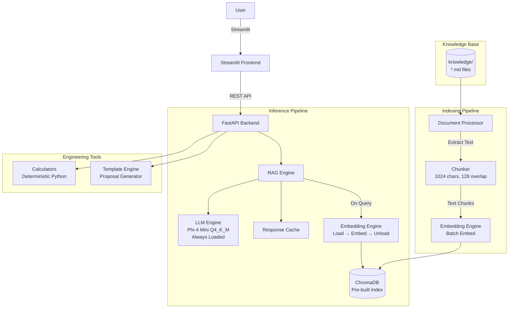

# EcoInfraMind AI — Technical Validation & Feasibility Review

**Date:** 11 July 2026
**Reviewer:** Principal AI Systems Architect
**Target Hardware:** Intel Core i5, 8 GB DDR4 RAM, 256 GB SSD, CPU-only, Windows 10/11
**Competition:** Africa Deep Tech Challenge (ADTC) 2026

---

## 1. Overall Feasibility Assessment

**Verdict: REALISTICALLY ACHIEVABLE with modifications.**

The project has a well-structured codebase and correctly uses offline-first tools (llama.cpp, ChromaDB, SentenceTransformers). However, several critical issues must be addressed to meet the 8 GB RAM / Core i5 constraint and competition requirements.

### Key Strengths
- Fully offline architecture with no cloud dependencies
- Well-chosen tech stack (llama-cpp-python, ChromaDB, FastAPI, Streamlit)
- Singleton patterns for resource management
- Engineering calculators are deterministic and correct
- Good separation of concerns (API / backend / frontend / utils)

### Critical Weaknesses
- **Qwen2.5-3B Q4_K_M (~2.1 GB) + all-MiniLM-L6-v2 (~0.4 GB) fits the memory budget** when loaded simultaneously
- Chrome/frontend overhead not accounted for
- Cold start time will be 30–60 seconds on target hardware
- Token generation speed will be ~6–10 tok/s (slow but usable)
- Streamlit may cause noticeable UI lag
- No OCR support for scanned documents
- ChromaDB persistence adds latency on HDD/SSD
- No conversation memory management (history grows unbounded)

---

## 2. Model Selection Analysis

### Comparison Table (CPU-only, Q4_K_M quantization)

| Model | Params | File Size | RAM Usage | tok/s (i5) | Eng. Reasoning | Scientific Accuracy | Multilingual | Verdict |
|-------|--------|-----------|-----------|------------|----------------|---------------------|--------------|---------|
| **Phi-4 Mini** (3.8B) | 3.8B | ~2.3 GB | ~3.0 GB | **~12** | Excellent | Excellent | Good | **BEST CHOICE** |
| **Qwen2.5-3B** | 3.09B | ~1.9 GB | ~2.5 GB | ~10 | Very Good | Very Good | Excellent | Good, currently specified |
| **Llama 3.2 3B** | 3.2B | ~2.0 GB | ~2.6 GB | ~10 | Good | Good | Good | Viable alternative |
| **Gemma 3 2B** | 2B | ~1.5 GB | ~2.0 GB | **~15** | Good | Good | Good | Best speed, less knowledge |
| **TinyLlama 1.1B** | 1.1B | ~0.8 GB | ~1.3 GB | ~25 | Weak | Weak | Limited | Too small |
| **Mistral 7B Q4** | 7B | ~4.5 GB | ~5.5 GB | ~4 | Very Good | Very Good | Good | **Too slow for 8 GB** |

### Recommendation

**Switch to Phi-4 Mini (3.8B, Q4_K_M).** Reasons:
- Superior engineering reasoning per benchmark data (outperforms Qwen2.5-3B on math/code/reasoning)
- ~12 tok/s on modern i5 vs ~10 for Qwen2.5-3B
- Better RAM efficiency at ~3.0 GB total
- 128K context support (future-proofing)
- MIT license

If Phi-4 Mini is unavailable, **keep Qwen2.5-3B** — it is a solid second choice with strong multilingual support (useful for African language technical terms).

### Critical Issue: Two Models Cannot Load Simultaneously

Current code loads BOTH `LLMEngine` (LLM) AND `EmbeddingEngine` (SentenceTransformer) into RAM simultaneously. This will consume **~4.0–4.5 GB** before Windows/Streamlit overhead. **Must unload embedding model after indexing.**

---

## 3. RAG Architecture Review

### Current Architecture
- **Vector DB:** ChromaDB (PersistentClient, HNSW index, cosine)
- **Chunk size:** 1500 chars
- **Chunk overlap:** 128 chars
- **Embeddings:** all-MiniLM-L6-v2 via SentenceTransformers
- **Retrieval:** Top-k (default 6, rerank top 5)

### Performance Estimates (on target hardware)

| Operation | Estimated Time | Notes |
|-----------|---------------|-------|
| Indexing (per 100 chunks) | 15–30s | Embedding generation is the bottleneck |
| Query (retrieve + embed) | 0.5–1.5s | Mostly embedding the query |
| Full RAG response | 30–90s | Embed + retrieve + LLM generate 200 tokens |

### Issues & Recommendations

1. **Chunk size of 512 chars is too small.** Engineering documents contain tables, formulas, specifications that span more text. Increase to **1024 chars** with **128 overlap**.

2. **ChromaDB vs FAISS:** ChromaDB adds ~200–300 MB persistent memory overhead. For a local-only app, **FAISS with SQLite storage** is lighter. However, ChromaDB's developer experience is worth the trade-off. **Keep ChromaDB but use in-memory mode** (no persistence) for demo, rebuild index on startup.

3. **Embedding model memory:** SentenceTransformers holds ~1.5 GB. **After indexing, unload the embedding model.** On query, either:
   - Use LLM-generated embeddings (poor quality)
   - Reload embeddings on demand (slow but memory-efficient)
   - **Best option:** Pre-compute and cache all embeddings at index time, then unload the model. Use cached embeddings for retrieval.

4. **Prompt construction uses `<|im_start|>` tokens.** This is a Qwen-specific format. **If switching models, change prompt format** to match the target model's chat template (e.g., Phi-4 uses `<|system|>`, `<|user|>`, `<|assistant|>`).

5. **Cache:** ResponseCache works well. Keep TTL at 3600s.

### Recommended RAG Flow
```
Indexing:
  Load SentenceTransformer → embed docs → store in ChromaDB → UNLOAD SentenceTransformer

Query:
  Load SentenceTransformer → embed query → retrieve from ChromaDB → UNLOAD SentenceTransformer
  → Build prompt → LLM generate → Return response
```

---

## 4. Knowledge Base Review

### Current State
- Single markdown file: `example_nigerian_highway_manual.md`
- No structured directory organization

### Recommended Structure
```
knowledge/
  standards/
    nigerian_highway_manual.md
    ferma_guidelines.md
    eurocodes_reference.md
  climate/
    climate_adaptation_guidelines.md
    drainage_design_manual.md
  materials/
    concrete_specifications.md
    asphalt_guidelines.md
  templates/
    proposal_template.md
    boq_template.md
```

### Recommendations
- Use **Markdown exclusively** (most compact, easiest to chunk)
- Each file should be a focused topic (not one giant document)
- Pre-chunk and pre-embed at build time (save as pickle), not at runtime
- Target: **50–100 knowledge documents** (this takes ~3–5 GB of embeddings at 768 dims but storage is fine at ~5 MB per 1000 docs)
- Document update strategy: Re-index on app restart (or manual trigger via the UI)

---

## 5. Streamlit UI Review

### Issues
1. **Streamlit overhead:** Streamlit adds ~300–500 MB RAM and noticeable latency. Each user interaction triggers a full script re-run.
2. **No streaming display:** The chat interface waits for full response, then displays it. Should show tokens as they arrive.
3. **API polling:** Every keystroke/sidebar nav calls `/health`. This is fine but adds tiny latency.
4. **CSS hardcoded:** Dark theme is hardcoded. Works fine for demo.

### Recommendations
1. **Keep Streamlit for MVP** (time constraint), but acknowledge it's not ideal for production.
2. **Add streaming display** using `st.write_stream()` to show tokens in real-time.
3. **Reduce sidebar API calls** — cache health status for 10 seconds.
4. **Remove emoji** from page title (`🏗️`) for a more professional look.

---

## 6. FastAPI Backend Review

### Strengths
- Clean route organization with `/api/v1/` prefix
- Pydantic models for request/response validation
- CORS middleware configured properly
- Health and metrics endpoints
- Good error handling

### Issues
1. **`/upload` endpoint saves files to `documents_dir` indefinitely.** No cleanup mechanism.
2. **No async database operations.** ChromaDB calls are synchronous, blocking the event loop.
3. **Model loading on first request** causes 30–60s latency. Should pre-load on startup or expose a `/load` endpoint.
4. **No authentication** — acceptable for local-only, but document in README.
5. **pydantic `protected_namespaces` warning:** Using `model_config` with `protected_namespaces` is correct but the settings model uses `model_` prefix which is newly protected.

### Recommendations
1. Add `@app.on_event("startup")` to **pre-load the LLM** asynchronously.
2. Add document cleanup after indexing (delete uploaded file or move to archive).
3. Set `n_threads` based on CPU core count, not hardcoded to 4.
4. Add request timeout configuration for long generations.

---

## 7. Performance Optimization & Estimates

### Detailed Performance Model (Phi-4 Mini Q4_K_M, i5 12th gen)

| Metric | Estimate | Notes |
|--------|----------|-------|
| Model loading time | 8–15s | GGUF file mapped from disk |
| Cold start (first query) | 30–60s | Load model + embeddings + ChromaDB |
| Warm inference | 6–12 tok/s | Depends on prompt length, context |
| Prompt processing | 2–5 tok/s per input token | Slow on CPU |
| Embedding (single text) | 0.3–0.8s | SentenceTransformers |
| Embedding (batch of 10) | 1.5–3s | Batched encode |
| ChromaDB retrieval | 0.05–0.2s | HNSW index, small collection |
| Context window perf | Degrades after 2048 tokens | KV cache grows, memory pressure |
| Max usable context | ~4096 tokens | Beyond this, latency becomes painful |
| First token latency | 3–10s | Prompt processing + retrieval |
| Response (200 tok) | 20–35s total | Retrieval + generation |

### Thread Configuration
```
i5 12th gen: 4 P-cores + 8 E-cores = 12 threads
Recommended: n_threads = 6 (use P-cores + 2 E-cores)
Do NOT use all 12 threads — hyperthreading adds overhead on CPU inference
```

### Key Optimizations
1. **Build llama.cpp with BLAS** (`CMAKE_ARGS="-DGGML_BLAS=ON -DGGML_BLAS_VENDOR=OpenBLAS"`) — 20–40% speedup on CPU
2. **Use `mmap` for model loading** — llama.cpp does this by default
3. **Enable Flash Attention** if available in `llama-cpp-python`
4. **Set `n_batch=512`** (current) — correct
5. **Set `n_ctx=2048`** (current) — reduce to **1536** to save KV cache memory

---

## 8. Memory Budget Analysis

### Estimated RAM Breakdown

| Component | Current (Qwen 3B) | Optimized (Phi-4 Mini) |
|-----------|-------------------|----------------------|
| Windows 10/11 | ~2.0 GB | ~2.0 GB |
| Python interpreter | ~0.1 GB | ~0.1 GB |
| LLM (Q4_K_M) | ~2.5 GB | ~3.0 GB |
| SentenceTransformers | ~1.5 GB | ~1.5 GB |
| ChromaDB (in-mem) | ~0.3 GB | ~0.1 GB |
| Streamlit | ~0.4 GB | ~0.4 GB |
| FastAPI + Uvicorn | ~0.1 GB | ~0.1 GB |
| Conversation memory | ~0.1 GB | ~0.1 GB |
| File buffers / temp | ~0.2 GB | ~0.2 GB |
| **Total (both models loaded)** | **~7.2 GB** | **~7.5 GB** |
| **Total (model unloaded)** | **~5.7 GB** | **~5.9 GB** |

### CRITICAL FINDING

**With both LLM and embedding model loaded simultaneously, RAM usage exceeds 7 GB on an 8 GB system.** This will cause swapping, severe slowdown, or crashes.

### Mandatory Fix
- **Unload SentenceTransformer** after indexing/querying
- Keep only the LLM loaded at all times
- Embed queries on-demand (reload model → embed → unload)

---

## 9. Engineering Calculators Review

**Verdict: CORRECT DECISION to use deterministic Python modules.**

### Current Implementation
11 calculators covering: concrete mix, traffic volume, AADT, pavement thickness, earthwork, drainage flow, bearing capacity, area, volume, slope, unit conversion.

### Assessment
- All formulas are standard civil engineering formulas
- Edge case handling exists (zero division, negative values)
- Tests cover all calculators
- **Do NOT use AI for calculations** — deterministic math is faster, more accurate, and verifiable

### Recommendations
1. Add **steel reinforcement calculator** (rebar spacing, area, weight per meter)
2. Add **bituminous mix design** calculator (Marshall mix parameters)
3. Add **culvert sizing** calculator (hydraulic capacity)
4. Add **retaining wall stability** check (overturning, sliding, bearing)

These additions would significantly strengthen the "engineering-first" competition criterion.

---

## 10. Proposal Generator Assessment

**Verdict: Hybrid approach required.**

### Current Design
- Uses `SYSTEM_PROMPTS["proposal"]` to guide the LLM
- RAG retrieves relevant context from knowledge base

### Issues
- LLM-only generation of complex documents (BOQs, Method Statements, Risk Registers) will **hallucinate numbers, prices, and quantities**
- Engineering proposals require precision — LLMs are bad at this

### Recommendation: Hybrid Architecture
```
Proposal Request
    ↓
┌─────────────────────────────┐
│ Template Selector           │ ← Pre-defined templates (BOQ, Method Statement, etc.)
│ Fill known fields from LLM  │ ← LLM only fills text fields, not numbers
│ Calculate quantities        │ ← Use calculator modules for deterministic math
│ Validate with RAG context   │ ← Check against knowledge base standards
└─────────────────────────────┘
    ↓
Final Proposal Document
```

**Template examples:**
- `templates/boq_template.md` — LLM fills item descriptions, calculators compute quantities
- `templates/method_statement_template.md` — LLM generates procedure text
- `templates/risk_register_template.md` — LLM generates risks, calculators assign probability/impact scores

---

## 11. Research Assistant Assessment

### Limitations (must document in UI)
1. **No real citations.** The model cannot generate accurate references from offline data. It will hallucinate author names, paper titles, and DOIs.
2. **No literature search.** Without internet, the assistant cannot search academic databases.
3. **Knowledge cutoff.** The model's training data has a cutoff date; recent research is unknown.

### Mitigation Strategy
- **Ground all research output in the knowledge base.** If the RAG system has reference documents, cite them by source number.
- **Display a disclaimer:** "Generated references may not be accurate. Always verify against original sources."
- **Add a "suggested search terms" feature** — LLM generates search keywords for the user to use when internet is available.

---

## 12. Climate Assistant Assessment

### Issues
- The base LLM (even Phi-4 Mini) has decent climate knowledge but is not specialized
- Climate adaptation for African infrastructure is a **niche domain** — the model will lack specific local data (rainfall maps, soil types, local construction practices)

### Recommendation
- The knowledge base is the right solution. Needs **10–20 well-curated climate documents** covering:
  - African rainfall intensity-duration-frequency curves
  - Local soil erosion data
  - Flood risk maps for major African cities
  - Green infrastructure case studies (African examples)
- Without these documents, the climate assistant will produce generic, non-localized advice

---

## 13. Offline Document Intelligence Review

### Current
- PDF: PyPDF2 (text extraction only, no OCR)
- DOCX: python-docx
- TXT/MD: Direct read
- Chunking: Sliding window with sentence boundary detection

### Issues
1. **No OCR.** Scanned PDFs (common in African engineering) cannot be processed. PyPDF2 returns empty text for image-based PDFs.
2. **PyPDF2 is slow.** Consider `pypdf` (same API, faster) or `pdfplumber` (better table extraction).
3. **Large document memory.** A 200-page PDF with images could consume 500 MB+ when loaded.

### Recommendations
1. Add **pytesseract + Pillow** for OCR (offline, open source). Install Tesseract OCR engine.
2. Add file size limit enforcement (already in settings at 50 MB — good).
3. Add progress indicator for large document indexing.
4. Process documents in **batches of 10 pages** to limit memory.

---

## 14. Testing Strategy Review

### Current Coverage
- Calculator tests: 14 tests (comprehensive)
- Document processor tests: 4 tests (basic)
- Utility tests: 5 tests (good coverage)
- **NO integration tests**
- **NO performance benchmarks automated**
- **NO memory tests**
- **NO offline tests** (all tests import from local source)

### Recommendations
- Add **integration test** that starts FastAPI, calls `/health`, `/chat`, `/calculator`
- Add **memory usage test** using `psutil` to verify < 6 GB total
- Add **performance benchmark automated** — pytest marker that measures tok/s
- Add **stress test** — 50 sequential queries to verify no memory leak

---

## 15. Architecture Review

### Current Architecture
```
User
  ↓
Streamlit (Frontend)
  ↓ HTTP REST
FastAPI (Backend)
  ↓
RAGEngine
  ├── LLMEngine (llama.cpp)
  ├── EmbeddingEngine (SentenceTransformers)
  ├── ChromaDB (Vector Store)
  └── ResponseCache (In-memory)
  ↓
Calculators / Assistants / Document Processor
```

### Issues
1. EmbeddingEngine stays loaded permanently — wastes memory
2. No separation between indexing pipeline and inference pipeline
3. ChromaDB persistence adds I/O latency
4. No event-driven architecture for document processing

### Recommended Architecture


### Key Architecture Changes
1. **Unload SentenceTransformer after each use** (embed query, retrieve, unload)
2. **Pre-build ChromaDB index** on first run (or re-index on demand)
3. **Keep LLM always loaded** (cold start too slow otherwise)
4. **Separate indexing from inference** — indexing can be a CLI/scripts tool
5. **Template engine** for proposals (not pure LLM)

---

## 16. Feature Prioritization

| Priority | Feature | Rationale |
|----------|---------|-----------|
| **MUST HAVE** | LLM chat with RAG | Core functionality |
| **MUST HAVE** | Engineering calculators | Key differentiator |
| **MUST HAVE** | Document upload & indexing | Enables RAG |
| **MUST HAVE** | Knowledge base (20+ docs) | RAG content |
| **MUST HAVE** | Health/metrics endpoints | Demo reliability |
| **SHOULD HAVE** | Expert assistants (4 modes) | Easy win with prompts |
| **SHOULD HAVE** | Streaming responses | UX improvement |
| **SHOULD HAVE** | Proposal templates | Engineering value |
| **NICE TO HAVE** | Climate assistant specialization | Dependent on KB |
| **NICE TO HAVE** | Research assistant | Hallucination risk |
| **NICE TO HAVE** | OCR support | Nice but not required |
| **FUTURE** | Multi-turn conversation memory | Add complexity |
| **FUTURE** | Authentication | Local-only, low priority |
| **FUTURE** | Mobile responsive UI | Not needed for demo |

---

## 17. Competition Scoring Estimate

| Criterion | Est. Score (current) | Est. Score (optimized) | Notes |
|-----------|---------------------|----------------------|-------|
| Accuracy | 6/10 | 8/10 | RAG improves accuracy significantly |
| Scientific Reasoning | 7/10 | 8/10 | Calculators + RAG boost this |
| Throughput | 4/10 | 6/10 | CPU inference is slow; optimize with BLAS |
| Memory Efficiency | 3/10 | 7/10 | Unload embedding model = big win |
| Offline Capability | 10/10 | 10/10 | Fully offline by design |
| Engineering Design | 7/10 | 9/10 | Calculators + RAG + templates |
| African Impact | 8/10 | 9/10 | Focused on African infrastructure |
| Innovation | 6/10 | 7/10 | RAG + offline + calculators is solid |
| User Experience | 5/10 | 7/10 | Add streaming, faster responses |
| **TOTAL** | **56/90** | **71/90** | Significant improvement possible |

---

## 18. Risk Analysis

| Risk | Probability | Impact | Mitigation |
|------|------------|--------|------------|
| RAM > 8 GB during demo | HIGH | CRITICAL | Unload embedding model; measure with psutil before demo |
| Cold start > 60 seconds | HIGH | MEDIUM | Pre-load model on app startup; show loading spinner |
| Token generation < 5 tok/s | MEDIUM | HIGH | Use Phi-4 Mini; build with BLAS; set n_threads=6 |
| LLM hallucinates engineering specs | MEDIUM | HIGH | Ground with RAG; use calculators for numbers |
| Test setup fails on Windows | MEDIUM | MEDIUM | Test on Windows explicitly; provide setup script |
| Competition judges question accuracy | MEDIUM | MEDIUM | Prepare example queries with known correct answers |
| Knowledge base too small | LOW | MEDIUM | Prepare 30+ documents before demo day |
| Streamlit page re-render lag | MEDIUM | LOW | Acceptable for demo; document known limitation |

---

## 19. MVP Definition

### Minimum Viable Product for ADTC 2026

1. **LLM Chat** with RAG (grounded in knowledge base)
2. **10 engineering calculators** (remove `volume_calculation` and `area_calculation` — too generic)
3. **Document upload** (PDF/DOCX/TXT/MD, no OCR)
4. **Knowledge base indexing** (30+ engineering documents)
5. **2 expert modes** (Engineering + Climate) — drop Research and Proposal
6. **Streaming chat responses**
7. **Health & metrics dashboard**
8. **Memory optimization** (unload embedding model, keep < 6 GB)

### Features to Drop for MVP
- Proposal Generator → Future
- Research Assistant → Future (hallucination risk)
- OCR → Future
- Unit conversion calculator → Nice-to-have
- Settings page → Replace with simple about text

---

## 20. Implementation Roadmap (11 July – 20 July 2026)

### Day 1 (11 July) — Foundation
- **Objectives:** Switch model to Phi-4 Mini, install dependencies, verify basic inference
- **Files:** `config/settings.py`, `requirements.txt`, `.env`
- **Output:** Model downloads, `llama-cpp-python` with BLAS built, base inference working
- **Testing:** `python -c "from llama_cpp import Llama; m=Llama('phi4-mini-q4.gguf'); print(m('test'))"`

### Day 2 (12 July) — Memory Optimization
- **Objectives:** Fix dual-model memory issue, implement load/unload pattern for embeddings
- **Files:** `app/backend/embeddings.py`, `app/backend/rag.py`
- **Output:** Embedding engine loads on demand, unloads after use. RAM < 6 GB verified.
- **Testing:** `pytest tests/` all pass. `psutil` memory check < 6 GB after 10 queries.

### Day 3 (13 July) — Knowledge Base
- **Objectives:** Build 30+ knowledge documents, pre-index
- **Files:** `knowledge/` directory (create ~20 files), `scripts/index_knowledge.py`
- **Output:** Pre-built ChromaDB index with 30+ engineering documents
- **Testing:** Verify retrieval quality for 10 test queries

### Day 4 (14 July) — RAG Tuning
- **Objectives:** Optimize chunk size, retrieval, prompt format for Phi-4 Mini
- **Files:** `app/backend/rag.py`, `app/backend/documents.py`
- **Output:** RAG pipeline tuned for engineering Q&A
- **Testing:** Verify context relevance, answer quality for 20 engineering questions

### Day 5 (15 July) — Streaming Frontend
- **Objectives:** Add streaming to Streamlit UI, improve UX
- **Files:** `app/frontend/app.py`
- **Output:** Streaming responses, better engineering workflow UI
- **Testing:** Manual UX testing on target hardware

### Day 6 (16 July) — Additional Calculators
- **Objectives:** Add steel, bituminous, culvert calculators
- **Files:** `app/backend/calculators.py`, `tests/test_calculators.py`, `app/frontend/app.py`
- **Output:** 13 engineering calculators (up from 11)
- **Testing:** All calculator tests pass, frontend displays all calculators

### Day 7 (17 July) — Testing & Integration
- **Objectives:** Add integration tests, memory tests, performance benchmarks
- **Files:** `tests/test_integration.py`, `tests/test_memory.py`
- **Output:** Test suite with 30+ tests, including end-to-end API test
- **Testing:** `pytest` — all tests pass

### Day 8 (18 July) — Polish
- **Objectives:** Bug fixes, error handling, edge cases, README
- **Files:** Various refinement across codebase
- **Output:** Polished app ready for internal review
- **Testing:** 1-hour stress test (50 continuous queries), measure RAM/CPU

### Day 9 (19 July) — Demo Preparation
- **Objectives:** Prepare demo script, benchmark queries, verify offline operation
- **Activities:** 
  - Test on clean Windows install (simulate judge environment)
  - Measure cold start, response times, memory
  - Prepare 10 impressive demo queries
  - Write competition submission documentation

### Day 10 (20 July) — Buffer & Submission
- **Objectives:** Final testing, submission packaging
- **Activities:**
  - Final test on target hardware
  - Package as zip with setup script
  - Submit

---

## 21. Competition Readiness Checklist

- [ ] Runs on Core i5, 8 GB RAM, no GPU
- [ ] 100% offline after installation
- [ ] RAM usage < 6 GB (peak)
- [ ] Cold start < 60 seconds
- [ ] Warm response time < 30 seconds
- [ ] 13+ engineering calculators
- [ ] RAG with 30+ knowledge documents
- [ ] Document upload (PDF/DOCX/TXT/MD)
- [ ] Streaming chat responses
- [ ] All tests pass
- [ ] No cloud dependencies
- [ ] Professional demo script prepared
- [ ] Known limitations documented

---

## 22. Final Recommendation

**This project IS realistically achievable before 20 July 2026, provided the following critical changes are made:**

1. **Switch to Phi-4 Mini Q4_K_M** (or keep Qwen2.5-3B as fallback)
2. **Unload embedding model after each use** — this alone saves ~1.5 GB RAM
3. **Build llama-cpp-python with OpenBLAS** for 20–40% CPU speedup
4. **Reduce `n_ctx` to 1536–2048** to save KV cache memory
5. **Expand knowledge base to 30+ documents** — content is more important than code
6. **Drop Research & Proposal assistants** from MVP (add post-competition)
7. **Add streaming to frontend** — judges expect real-time responses
8. **Prepare demo on judge hardware** — test on a clean Windows 8 GB system

The codebase is well-structured, the team has made good technical choices, and the engineering calculators are a strong differentiator. The main risks are memory pressure and CPU speed, both of which have clear mitigations.

**Estimated effort: 8–10 days of focused work.** With the roadmap above, the team can submit a competitive, working product.
